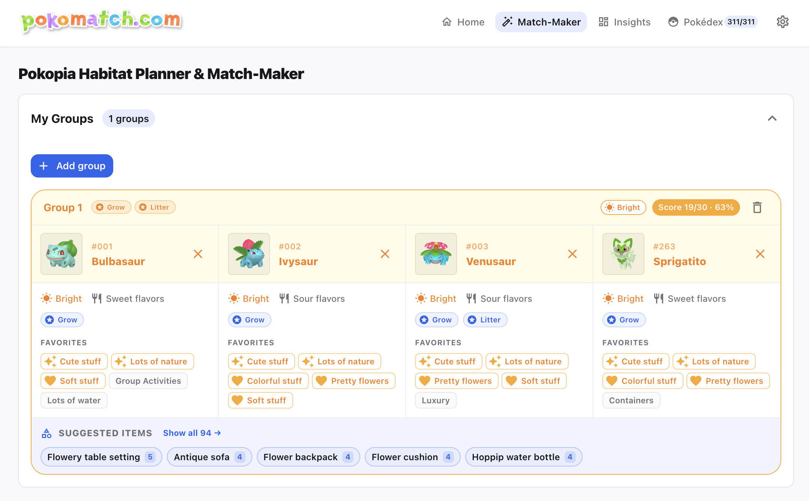

# PokoMatch - Pokopia Habitat Planner

**[pokomatch.com](https://pokomatch.com)** — Web companion for planning Pokémon habitats in _Pokémon Pokopia_: it groups Pokémon that can live together without clashing habitats, while pushing shared favorites so cohabiting groups are as aligned as possible.

## What the app does

- **Match Maker** — Builds **automatic groups of up to four** from the Pokémon you’ve marked as available. You can also create **custom groups**, edit who is in them, and get **ranked suggestions** for who to add next. Auto-generated groups can be pulled into your custom list.
- **Insights** — Read-only views over the full dataset: how Pokémon spread across **ideal habitats** and **favorite** tags.
- **Pokédex** — Browse and search everyone in the data, filter by habitat, and **lock or unlock** species so only your roster is used when matching.
- Pokemon name localization support for multiples languages (e.g. EN / DE / FR)
- Data is persisted locally in the browser

## How matching works

### 1. Habitat compatibility (hard constraint)

Each Pokémon has one **ideal habitat** (`Bright`, `Dark`, `Humid`, `Dry`, `Warm`, `Cool`). Some pairs are treated as **incompatible** if they would conflict each other in a shared space: Bright↔Dark, Humid↔Dry, Warm↔Cool.

A Pokémon may join a group only if **no existing member’s habitat conflicts with the newcomer’s** (and vice versa). If that fails, they cannot be in the same group, regardless of favorites.

### 2. Shared favorites (what it optimizes for)

Each Pokémon has a set of **favorite** tags (likes such as themes of items/nature — not flavor preferences). For any two Pokémon, **affinity** is the **number of favorite tags they share**.

### 3. Automatic grouping

Given the list of Pokémon to place (e.g. unlocked & habitable):

1. It creates candidate groups that obey habitat rules.
2. It compares different grouping options.
3. It prefers options where group members share more favorites overall.
4. It lightly refines the result to improve total group fit.
5. It returns groups of up to four; smaller groups are allowed when no valid fourth member exists.

The goal is to find strong practical groupings quickly, not to force a mathematically perfect solution.

### 4. Next member suggestions

For a partial group, candidates are **filtered** by the same habitat rules, then ranked by **how many favorites they share with the whole group**.

### 5. Group score

The **sum of pairwise shared favorites** within one group — the same quantity the auto-grouper tries to maximize across all groups.

## Credits

- Pokopia specific Pokemon data: [Serebii](https://www.serebii.net/)
- Pokémon data and localized species names: [PokeAPI](https://pokeapi.co/)
- Sprite repository source: [PokeAPI/sprites](https://github.com/PokeAPI/sprites)
